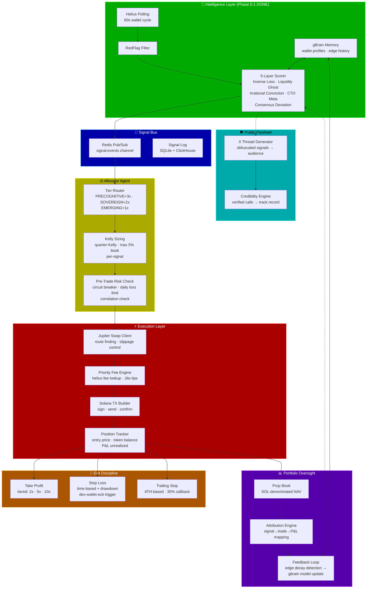
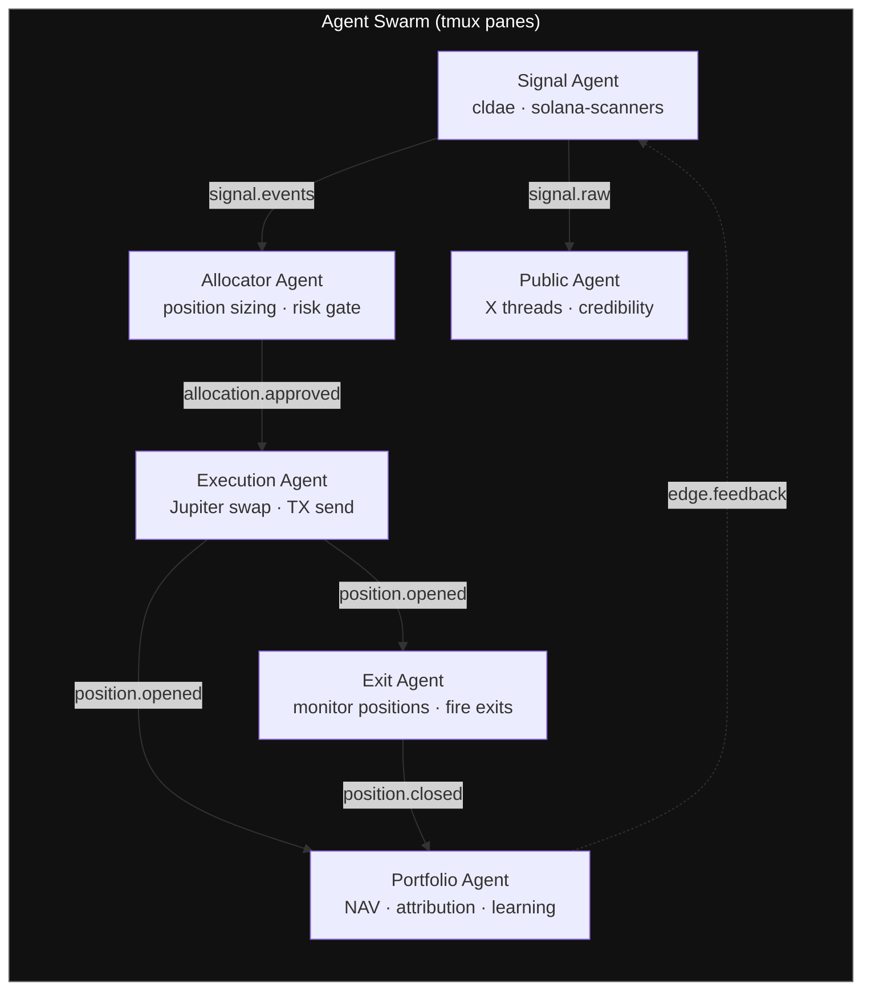
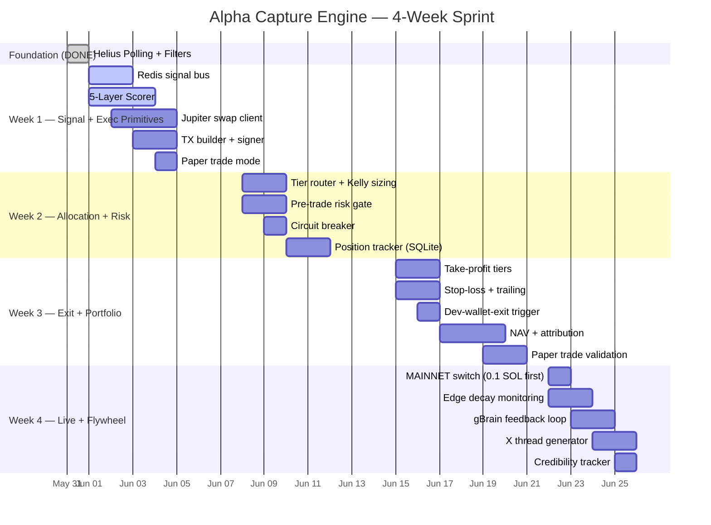

# Alpha Capture Engine — Master Plan

> **Self-modifying task tracker** — agents update status as work completes.
> Status: `[x]` done · `[~]` in-progress · `[ ]` todo · `[!]` blocked

---

## High-Level Architecture



---

## Execution Swarm — Agent Topology



---

## Detailed Task Breakdown

```mermaid
flowchart TD
    subgraph P0["Phase 0: Foundation ✅"]
        P0A[x Helius live polling]
        P0B[x RedFlag filter]
        P0C[x WalletActivity types]
        P0D[x Known PRECOGNITIVE/SOVEREIGN wallets]
    end

    subgraph P1A["Phase 1A: Signal Bus + Scoring"]
        P1A1["[ ] Redis pub/sub signal.events channel<br/>src/signal/bus.rs"]
        P1A2["[ ] 5-Layer Scorer implementation<br/>src/scoring/five_layer.rs"]
        P1A3["[ ] gBrain wallet profile integration<br/>src/scoring/profile.rs"]
        P1A4["[ ] Signal struct standardization<br/>src/signal/types.rs"]
        P1A5["[ ] ClickHouse signal logging<br/>src/signal/log.rs"]
    end

    subgraph P1B["Phase 1B: Execution Primitives"]
        P1B1["[ ] Jupiter swap client (quote + swap)<br/>src/execution/jupiter.rs"]
        P1B2["[ ] Priority fee engine<br/>src/execution/fees.rs"]
        P1B3["[ ] Solana TX builder + signer<br/>src/execution/tx_builder.rs"]
        P1B4["[ ] Position tracker (SQLite)<br/>src/execution/positions.rs"]
        P1B5["[ ] Paper trade mode (default)<br/>src/execution/paper.rs"]
    end

    subgraph P2A["Phase 2A: Allocator + Risk"]
        P2A1["[ ] Tier-based allocation router<br/>src/allocation/tier_router.rs"]
        P2A2["[ ] Quarter-Kelly position sizer<br/>src/allocation/kelly.rs"]
        P2A3["[ ] Pre-trade risk gate<br/>src/risk/pre_trade.rs"]
        P2A4["[ ] Circuit breaker + daily loss limit<br/>src/risk/circuit_breaker.rs"]
        P2A5["[ ] Correlation check (avoid 5 same-token bets)<br/>src/risk/correlation.rs"]
    end

    subgraph P2B["Phase 2B: Exit Discipline"]
        P2B1["[ ] Tiered take-profit (2x/5x/10x)<br/>src/exit/take_profit.rs"]
        P2B2["[ ] Time-based stop-loss (24h max hold for memecoin)<br/>src/exit/time_stop.rs"]
        P2B3["[ ] Dev-wallet-exit trigger (exit when tracked dev sells)<br/>src/exit/dev_exit.rs"]
        P2B4["[ ] Trailing stop (ATH-based, 30% callback)<br/>src/exit/trailing.rs"]
        P2B5["[ ] Exit execution via Jupiter<br/>src/exit/execute.rs"]
    end

    subgraph P3["Phase 3: Portfolio + Learning"]
        P3A["[ ] Prop book NAV tracker (SOL-denominated)<br/>src/portfolio/book.rs"]
        P3B["[ ] Attribution engine (signal→trade→P&L)<br/>src/portfolio/attribution.rs"]
        P3C["[ ] Edge decay detection<br/>src/portfolio/decay.rs"]
        P3D["[ ] gBrain feedback loop (model updates)<br/>src/portfolio/feedback.rs"]
        P3E["[ ] Dashboard (CLI first, web later)<br/>src/portfolio/dashboard.rs"]
    end

    subgraph P4["Phase 4: Public Flywheel"]
        P4A["[ ] X thread auto-generator (obfuscated signals)<br/>src/public/thread_gen.rs"]
        P4B["[ ] Credibility engine (verified calls tracker)<br/>src/public/credibility.rs"]
        P4C["[ ] Audience growth metrics<br/>src/public/metrics.rs"]
        P4D["[ ] External capital onboarding (performance fees)<br/>src/public/capital.rs"]
    end

    P0 --> P1A
    P0 --> P1B
    P1A --> P2A
    P1B --> P2A
    P1B --> P2B
    P2A --> P3
    P2B --> P3
    P3 --> P4

    style P0 fill:#0a0,stroke:#0f0,color:#fff
    style P1A fill:#aa0,stroke:#ff0,color:#000
    style P1B fill:#a00,stroke:#f00,color:#fff
    style P2A fill:#50a,stroke:#a0f,color:#fff
    style P2B fill:#a50,stroke:#fa0,color:#fff
    style P3 fill:#0aa,stroke:#0ff,color:#000
    style P4 fill:#0aa,stroke:#0ff,color:#000
```



---

## Gantt Timeline — Realistic Sequence



---

## File Structure — Target

```
solana-scanners/src/
├── main.rs                    # Tokio entry, orchestrates agents
├── lib.rs                     # Module declarations
├── config.rs                  # Env, keys, wallet list, risk params
│
├── aggregator/
│   ├── mod.rs
│   └── helius.rs              # [x] Live polling, TxSummary, WalletActivity
│
├── scoring/
│   ├── mod.rs
│   ├── five_layer.rs          # [ ] 5-layer behavioral model implementation
│   ├── inverse_loss.rs        # [ ] Inverse Loss Archaeology
│   ├── liquidity_ghost.rs     # [ ] Liquidity Ghost Detection
│   ├── irrational_conv.rs     # [ ] Irrational Conviction scoring
│   ├── cto_meta.rs            # [ ] CTO Meta-Reader
│   └── consensus_dev.rs       # [ ] Consensus Deviation
│
├── signal/
│   ├── mod.rs
│   ├── types.rs               # [ ] Signal, SignalTier, SignalStrength
│   ├── bus.rs                 # [ ] Redis pub/sub signal.events
│   └── log.rs                 # [ ] ClickHouse/SQLite signal persistence
│
├── allocation/
│   ├── mod.rs
│   ├── tier_router.rs         # [ ] PRECOGNITIVE=3x, SOVEREIGN=2x, EMERGING=1x
│   ├── kelly.rs               # [ ] Quarter-Kelly position sizing
│   └── risk_budget.rs         # [ ] Max positions, max daily exposure
│
├── execution/
│   ├── mod.rs
│   ├── jupiter.rs             # [ ] Jupiter v6 quote + swap API
│   ├── fees.rs                # [ ] Priority fee calculation + Jito tips
│   ├── tx_builder.rs          # [ ] Solana transaction construction + signing
│   ├── positions.rs           # [ ] SQLite position tracking
│   └── paper.rs               # [ ] Paper trading mode (default safe)
│
├── exit/
│   ├── mod.rs
│   ├── take_profit.rs         # [ ] Tiered TP: 2x, 5x, 10x
│   ├── stop_loss.rs           # [ ] Time-based + drawdown stops
│   ├── dev_exit.rs            # [ ] Trigger exit when tracked dev sells
│   └── trailing.rs            # [ ] ATH-based trailing stop
│
├── risk/
│   ├── mod.rs
│   ├── pre_trade.rs           # [ ] Pre-trade risk gate
│   ├── circuit_breaker.rs     # [ ] Daily loss limit, consecutive loss halt
│   └── correlation.rs         # [ ] Avoid over-concentration in same token
│
├── portfolio/
│   ├── mod.rs
│   ├── book.rs                # [ ] SOL-denominated NAV tracking
│   ├── attribution.rs         # [ ] Signal→trade→P&L mapping
│   ├── decay.rs               # [ ] Edge decay detection + alerting
│   └── feedback.rs            # [ ] gBrain model update loop
│
├── filters/
│   ├── mod.rs                 # [x]
│   └── red_flag.rs            # [x] Bot pattern detection
│
└── public/
    ├── mod.rs
    ├── thread_gen.rs           # [ ] Obfuscated X thread generator
    └── credibility.rs          # [ ] Verified call tracking
```

---

## Risk Matrix

| Risk | Severity | Mitigation |
|------|----------|------------|
| Wallet key exposure | CRITICAL | Encrypted keystore, env-only, never logged, paper-trade default |
| Jupiter slippage on low-liq memecoin | HIGH | Max slippage 15%, skip if < $1k liquidity |
| Signal edge decay | HIGH | Decay detector, auto-reduce sizing when win rate drops |
| Priority fee wars | MEDIUM | Helius fee lookup, Jito tip for time-sensitive entries |
| RPC rate limits | MEDIUM | Helius paid tier, retry with backoff |
| Bug in exit logic = stuck bags | HIGH | Paper trade first, kill switch, manual override CLI |
| Token rug while holding | HIGH | Dev-wallet-exit trigger, max hold 24h for < $50k mcap |
| Over-correlation (5 bets same meta) | MEDIUM | Correlation check in pre-trade risk gate |

---

## Quick Wins (Do First, High Impact)

1. **Paper trade pipeline** — end-to-end signal→allocation→paper-execute→track in < 2 days. Proves the architecture works before any real SOL.
2. **5-Layer Scorer** — the 5 behavioral models are the entire edge. Without them, execution is blind. Port from Grok task outputs → Rust code.
3. **Position tracker (SQLite)** — even paper trades need state. Enables P&L tracking and attribution from day 1.
4. **Jupiter swap client** — can be tested independently with 0.001 SOL. Proves execution primitive before wiring into the full pipeline.

## Long-Term Architecture (Post-MVP)

- External capital onboarding (performance fee structure)
- Multi-agent coordination via tmux panes (Signal Agent | Execution Agent | Exit Agent | Dashboard)
- gBrain autonomous model retraining when edge decay detected
- Web dashboard for real-time portfolio monitoring
- Webhook/websocket Helius integration for < 1s latency
- Cross-chain expansion (Base memecoins via existing Alchemy keys)

---

## Self-Modifying Protocol

This file is the source of truth for task status. Agents update it:
- When a task starts: change `[ ]` → `[~]`
- When a task completes: change `[~]` → `[x]`
- When blocked: change `[ ]` → `[!]`
- Mermaid diagrams reflect current state on every commit
- `bd sync` after status changes to propagate

---

## Parallelization Map (tmux panes)

```
┌──────────────────────┬──────────────────────┐
│ Pane 1: Signal Agent │ Pane 2: Exec Agent   │
│ cldae (solana-       │ Jupiter swap loop    │
│ scanners Helius      │ Position monitor     │
│ polling + scoring)   │ Exit trigger watch   │
├──────────────────────┼──────────────────────┤
│ Pane 3: Public Agent │ Pane 4: Dashboard    │
│ X thread generation  │ Portfolio NAV        │
│ Credibility tracking │ Attribution feed     │
│                      │ Risk metrics         │
└──────────────────────┴──────────────────────┘
```

---

## Key Dependencies

```
polymarket-auto/patterns → allocation/kelly.rs (reuse quarter-Kelly)
polymarket-auto/patterns → risk/circuit_breaker.rs (reuse daily limits)
clawREFORM/patterns     → signal/bus.rs (agent event architecture)
../src/rust/risk/        → risk/ (existing circuit breaker code)
../src/rust/txeng/       → execution/tx_builder.rs (existing TX engine)
../src/rust/shared/      → Redis + ClickHouse helpers
```

---

*Last updated: 2026-05-31 by alpha-planner agent*
*Next action: Begin Phase 1A — Redis signal bus + 5-Layer Scorer*
